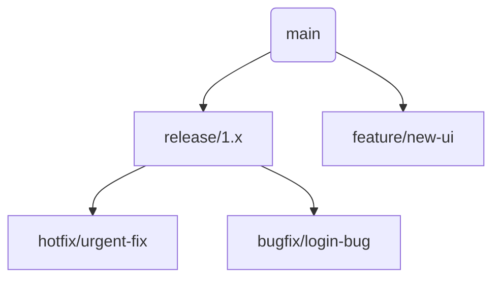
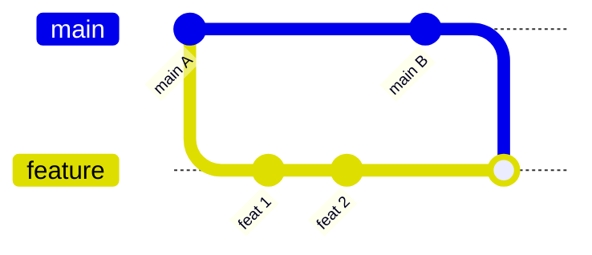

# 📘 GITRULES.README.md

> Git conventions, structure, and practices for our React project.

---

## 🧭 Branching Strategy



### 📌 Branch Naming Conventions

| Type    | Prefix     | Example                   |
| ------- | ---------- | ------------------------- |
| Feature | `feature/` | `feature/dashboard-stats` |
| Bugfix  | `bugfix/`  | `bugfix/fix-toast-error`  |
| Hotfix  | `hotfix/`  | `hotfix/production-crash` |
| Release | `release/` | `release/2.0.0`           |

---

## ✍️ Conventional Commits

We follow the [Conventional Commits v1.0.0](https://www.conventionalcommits.org/en/v1.0.0/#summary) format:

```
<type>[optional scope]: <description>
```

### 📋 Allowed `<type>` values

| Type     | Description                                             |
| -------- | ------------------------------------------------------- |
| feat     | A new feature                                           |
| fix      | A bug fix                                               |
| docs     | Documentation only changes                              |
| style    | Formatting, missing semi-colons, etc                    |
| refactor | Code change that neither fixes a bug nor adds a feature |
| perf     | Code that improves performance                          |
| test     | Adding or updating tests                                |
| chore    | Other changes that don’t modify src or tests            |
| build    | Changes that affect build system or dependencies        |
| ci       | Changes to CI configuration files and scripts           |

### ✅ Example

```bash
git commit -m "feat(auth): add passwordless login"
git commit -m "fix(api): handle 500 error in /users"
git commit -m "docs(readme): update contributing section"
```

---

## 🔁 Merge vs Rebase

### git merge



* ✔ Preserves full history  
* ✔ Best when working collaboratively  
* ❌ Can clutter commit history  

```bash
git checkout feature/some-task
git merge main
```

---

### git rebase


* ✔ Clean, linear history  
* ✔ Best before merging to `main`  
* ❌ Rewrites history (avoid on shared branches)  

```bash
git checkout feature/some-task
git pull --rebase origin main
```

---

## 🧩 Git Snippets

### 🧙 git stash

Temporarily saves your uncommitted changes:

```bash
git stash
git pull origin main
git stash pop
```

---

### 🍒 git cherry-pick

Copy a commit from another branch:

```bash
git cherry-pick <commit-hash>
```

---

### 🔂 git rebase -i (interactive)

Squash or reorder commits:

```bash
git rebase -i HEAD~3
# change "pick" to "squash" to combine
```

---

### 🧽 git reset

```bash
git reset --soft HEAD~1   # keeps changes staged
git reset --hard HEAD~1   # discards changes
```

---

## 🔧 Recommended Tools

### ✅ [GitKraken](https://www.gitkraken.com/)

* Visual Git GUI  
* Drag-and-drop merge/rebase  
* Conflict resolution  
* View PRs, commits, and branches graphically  

### ✅ [GitLens for VSCode](https://gitlens.amod.io/)

* Inline blame  
* File and line history  
* Code authorship tracking  

---

## ✅ Best Practices Checklist

* [ ] Use `feature/`, `bugfix/`, `hotfix/`, etc. for branches  
* [ ] Use Conventional Commits for all messages  
* [ ] Rebase local feature branches before pushing  
* [ ] Pull with `--rebase` to keep clean history  
* [ ] Avoid force pushing to shared branches  
* [ ] Squash commits before merge if possible  
* [ ] Always link PRs to design (Figma) and tasks (Jira)  

---

> _"Clean Git = Clean History = Happy Team"_ 🎯
