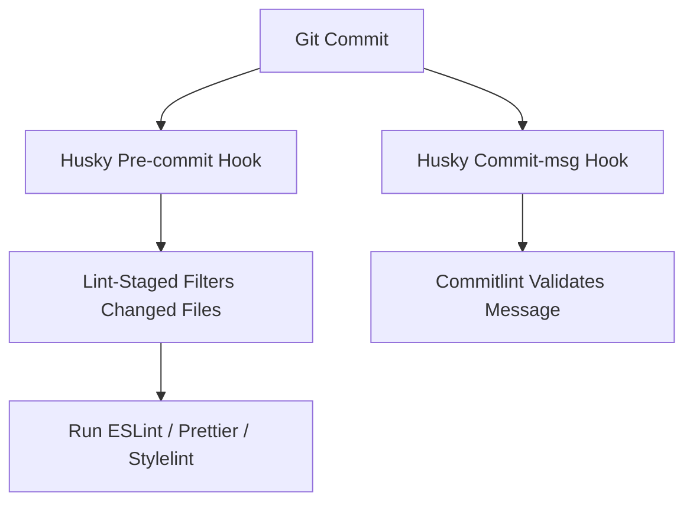

# 📘 Prettier, ESLint, Husky, Commitizen, Stylelint

This guide is for setting up a modern, scalable frontend development environment with:

* **React** (library)
* **Vite** (bundler)
* **TypeScript** (type-safety)
* **Sass** (CSS preprocessor)
* **Prettier** (code formatter)
* **ESLint** (linter)
* **Husky + lint-staged** (pre-commit checks)
* **Commitizen + Conventional Commits** (structured Git commits)
* **Stylelint** (for SCSS/SASS linting)

> Inspired by best practices from **Airbnb**, **Google**, and **Uber** engineering teams.

---

## 📁 Project Initialization

```bash
npm create vite@latest my-app --template react-ts
cd my-app
```

Install dependencies:

```bash
npm install -D eslint prettier stylelint stylelint-scss \
  husky lint-staged commitizen @commitlint/{cli,config-conventional} \
  @typescript-eslint/eslint-plugin @typescript-eslint/parser eslint-config-prettier \
  eslint-plugin-react eslint-plugin-react-hooks eslint-plugin-jsx-a11y \
  sass
```

---

## 🧠 Directory Structure

```text
my-app/
├── .husky/
│   ├── pre-commit
│   └── commit-msg
├── public/
├── src/
│   ├── components/
│   ├── styles/
│   ├── App.tsx
│   └── main.tsx
├── .eslintrc.cjs
├── .prettierrc
├── .stylelintrc.cjs
├── .lintstagedrc.cjs
├── commitlint.config.cjs
├── tsconfig.json
├── vite.config.ts
└── package.json
```

---

## ✨ Prettier Setup

**`.prettierrc`**

```json
{
  "semi": false,
  "singleQuote": true,
  "printWidth": 100,
  "trailingComma": "all",
  "tabWidth": 2,
  "arrowParens": "avoid"
}
```

**`.prettierignore`**

```text
node_modules
build
dist
```

Run formatter:

```bash
npx prettier . --write
```

---

## 🧹 ESLint Setup

**`.eslintrc.cjs`**

```js
module.exports = {
  parser: '@typescript-eslint/parser',
  extends: [
    'eslint:recommended',
    'plugin:react/recommended',
    'plugin:jsx-a11y/recommended',
    'plugin:@typescript-eslint/recommended',
    'plugin:react-hooks/recommended',
    'prettier',
    'airbnb',
    'airbnb-typescript'
  ],
  plugins: ['react', '@typescript-eslint', 'react-hooks', 'jsx-a11y'],
  parserOptions: {
    ecmaVersion: 2020,
    sourceType: 'module',
    ecmaFeatures: {
      jsx: true
    },
    project: './tsconfig.json'
  },
  rules: {
    'react/react-in-jsx-scope': 'off',
    '@typescript-eslint/explicit-function-return-type': 'warn',
    'import/prefer-default-export': 'off',
    'react/prop-types': 'off',
    'no-console': 'warn'
  },
  settings: {
    react: {
      version: 'detect'
    }
  }
}
```

> Based on rules from Airbnb + best practices from Google (strict typing, return types) + Uber (modular, low mutation).

---

## 🎨 Stylelint Setup (SCSS)

**`.stylelintrc.cjs`**

```js
module.exports = {
  extends: ['stylelint-config-standard-scss'],
  rules: {
    'at-rule-no-unknown': null,
    'scss/at-rule-no-unknown': true,
    'selector-class-pattern': [
      '^[a-z0-9\-]+$',
      {
        message: 'Use kebab-case for class names.'
      }
    ]
  }
}
```

**`.stylelintignore`**

```text
node_modules
build
dist
```

Run Stylelint:

```bash
npx stylelint "**/*.{scss,css}" --fix
```

---

## 🛠️ Husky + lint-staged

### Init Husky

```bash
npx husky install
npm pkg set scripts.prepare="husky install"
```

### Add Hooks

```bash
npx husky add .husky/pre-commit "npx lint-staged"
npx husky add .husky/commit-msg 'npx --no -- commitlint --edit $1'
```

**`.husky/pre-commit`**

```bash
#!/bin/sh
. "$(dirname "$0")/_/husky.sh"

npx lint-staged
```

**`.husky/commit-msg`**

```bash
#!/bin/sh
. "$(dirname "$0")/_/husky.sh"

npx --no -- commitlint --edit "$1"
```

### `.lintstagedrc.cjs`

```js
module.exports = {
  '*.{ts,tsx}': ['eslint --fix', 'prettier --write'],
  '*.{scss,css}': ['stylelint --fix'],
  '*.{js,ts,tsx,json,md}': ['prettier --write']
}
```

---

## 📓 Commitizen + Conventional Commits

Initialize:

```bash
npx commitizen init cz-conventional-changelog --save-dev --save-exact
```

**`.czrc`**

```json
{
  "path": "cz-conventional-changelog"
}
```

### `commitlint.config.cjs`

```js
module.exports = {
  extends: ['@commitlint/config-conventional']
}
```

Use:

```bash
npx cz
```

---

## 🔁 Git Hook Workflow Diagram (Mermaid)



---

## 🧪 Scripts in `package.json`

```json
"scripts": {
  "lint": "eslint . --ext .ts,.tsx",
  "lint:style": "stylelint \"**/*.{scss,css}\"",
  "format": "prettier --write .",
  "prepare": "husky install",
  "commit": "cz"
}
```

---

## 📏 Coding Rules from Airbnb, Google, Uber

### Airbnb

* Prefer `const` over `let` when reassignment is not needed
* Enforce destructuring
* Avoid nested ternaries
* Use trailing commas in multi-line objects

### Google

* Use `PascalCase` for types and classes
* Avoid using `any`, use `unknown` and narrow types
* Prefer single quotes for strings
* Prefer default exports only when one entity is being exported

### Uber

* Avoid type assertions (`as`) unless absolutely required
* Use `readonly` for immutable objects
* Prefer explicit return types
* Treat warnings as errors in CI

> These rules are enforced via ESLint plugins and extended configurations. You can extend Airbnb config via:

```bash
npm install -D eslint-config-airbnb eslint-plugin-import eslint-plugin-jsx-a11y eslint-plugin-react eslint-plugin-react-hooks
```

Update `.eslintrc.cjs`:

```js
extends: [
  'airbnb',
  'plugin:react-hooks/recommended',
  'plugin:@typescript-eslint/recommended',
  'prettier'
]
```

---

## ✅ Final Rules Summary

| Tool        | Purpose                          | Key Files                        |
| ----------- | -------------------------------- | -------------------------------- |
| Prettier    | Format code consistently         | `.prettierrc`, `.prettierignore` |
| ESLint      | Catch JS/TS issues early         | `.eslintrc.cjs`                  |
| Stylelint   | Enforce SCSS/CSS standards       | `.stylelintrc.cjs`               |
| Husky       | Git hooks manager                | `.husky/` folder                 |
| Lint-staged | Run linters only on staged files | `.lintstagedrc.cjs`              |
| Commitizen  | Standardize commit messages      | `.czrc`                          |
| Commitlint  | Validate commit message formats  | `commitlint.config.cjs`          |

---

> This setup ensures all code is consistent, commit messages are standardized, and your CI/CD pipeline stays clean. Built from real-world best practices by Google, Airbnb, and Uber.
